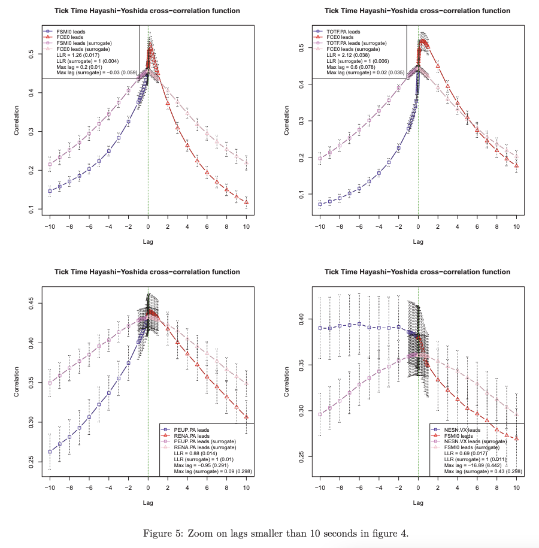
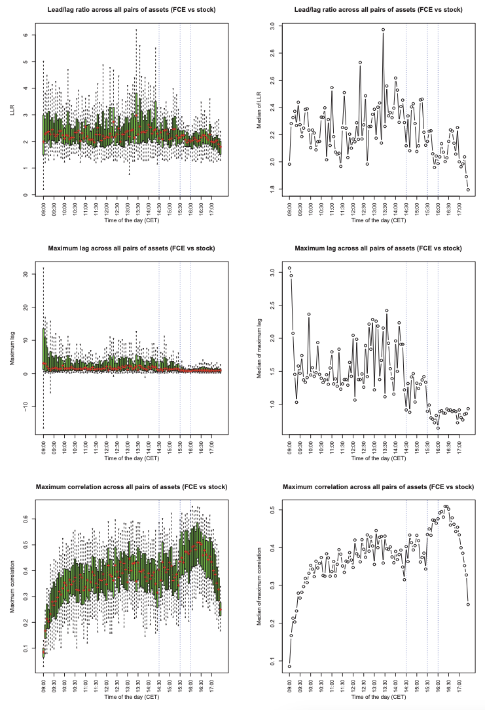
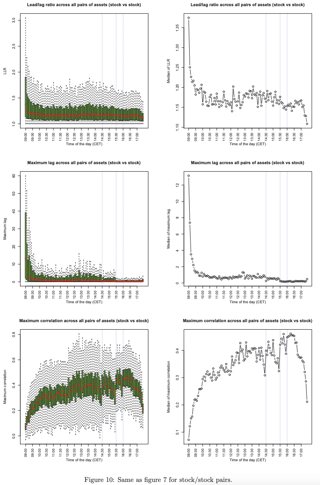
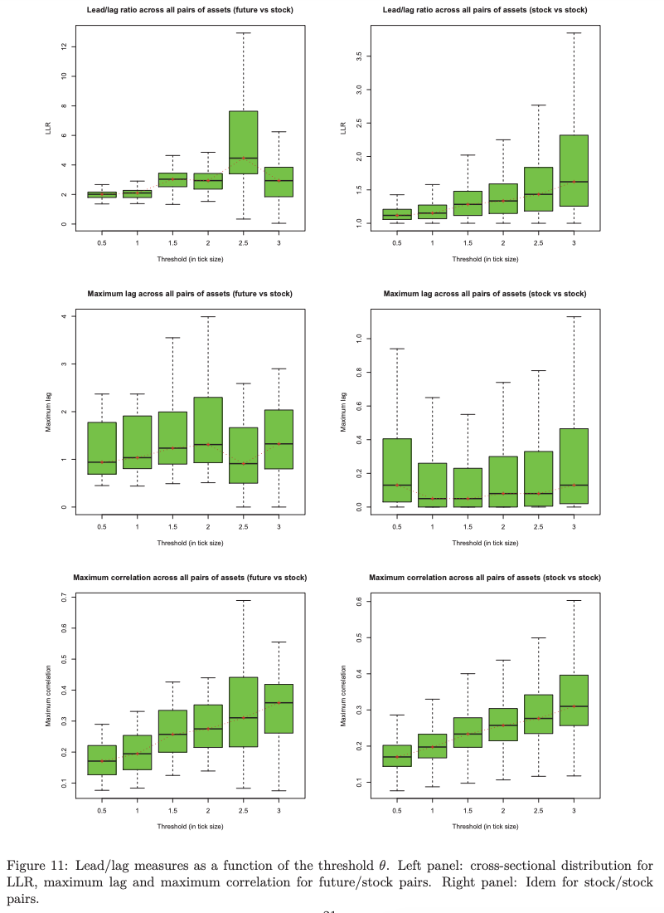
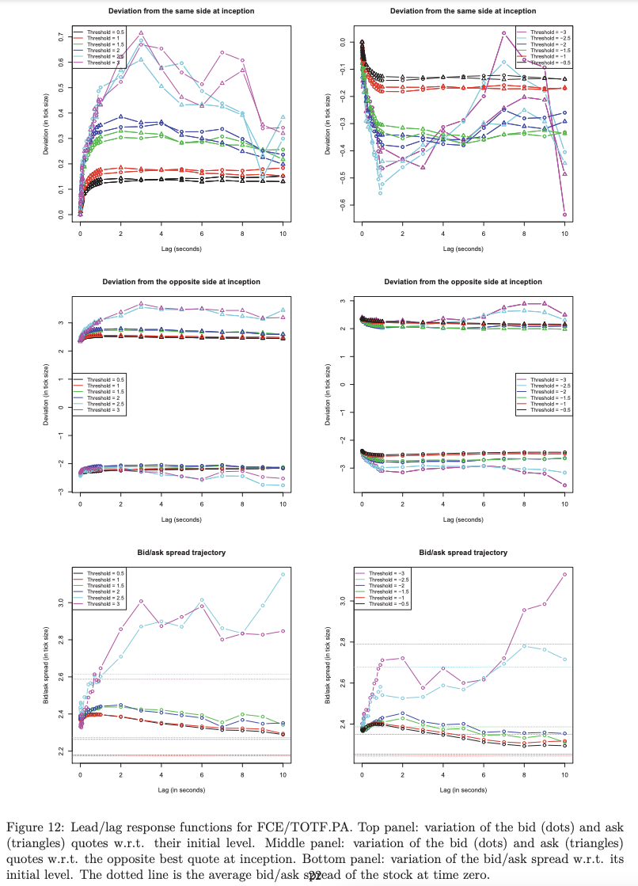

# Lead-Lag relationship

该篇的目的是研究UHF视角下的资产回报之间的关联性。我选择的论文是arxiv上的最初版本，该版本相比于直接发表在期刊上的版本，少了很多对于theory的阐述，整体写作逻辑更精炼。

## Abstract
论文发现如下：
1. 更高流动性的asset更有可能lead流动性低的asset（这里给了高流动性的定义: short intertrade duration, narrow bid/ask spread, small volatility, high turnover）
2. 但是关联性最高的 asset pair 往往是具有相似流动性的。
3. lead lag relationship 在日内并不是一个定值，可能受到一些宏观的影响出现周期性
4. 当我们专注于一些 events 的时候， relationship十分显著。

通过使用 lead-lag relationship 辅助 predict mid quote 的变化，可以达到60%的准确率。高于直接基于 lag assets 的历史数据进行预测。但是这个策略却很难直接应用于一些策略，主要原因是市场的交易成本以及 bid-ask spread。

## 1.Data description
数据预处理：
1. 对于高频数据来说（A股市场同理），tick数据一般分为 quote，trade，order 三类，这里只使用trade以及quote数据。
2. 对于trade数据来说，如果一次交易分别成交在了两个价位上，记录会分成两条记录，对于这样的一次交易分两条记录的情况，我们把数据aggregate，记录的价格是vwap价格，成交量是这两条的加和。也就是说对于每一个独立的成交事件（在数据表单中是timstamps），有且仅有一条记录在表格当中。
3. 只考虑equities以及对应的futures，原论文给出了汇总表格。

作者同时使用了一些指标来衡量asset的流动性，如下：
+ the average duration between two consecutive trades $<\Delta t>$，连续两次交易的平均时间间隔
+ the average tick size δ in percentage of the midquote $<\delta/m>$，tick size和平均midquote的比
+ the average bid/ask spread expressed in tick size $ <s>/\delta$ 平均 bidask spread 和tick的比值
+ the frequency of unit bid/ask spread $1_{\{s=δ\}}$ bidask spread 恰好为一个标准tick的出现频率
+ the frequency of trades hitting more than the best limit price available $1_{\{trade \ through\}}$ 交易突破最优价格的频率
+ a proxy for the daily volatility expressed in tick size : $<|\Delta m|>/\delta$, where $\Delta m$ is the midquote variation between two consecutive trades 连续两次交易的变化与tick的比值
+ the average turnover per trade $<P_{trade}V_{trade}>$

## 2. Methodology

### 2.1 HY cross correlation func
对于两个异步的扩散过程XY，我们假设他们复合伊藤过程：
$$
\begin{gathered}
\mathrm{d}X_{t}=\mu_{t}^{X}\mathrm{d}t+\sigma_{t}^{X}\mathrm{d}W_{t}^{X} \\
\mathrm{d}Y_{t}=\mu_{t}^{Y}\mathrm{d}t+\sigma_{t}^{Y}\mathrm{d}W_{t}^{Y} \\
\mathrm{d}\left\langle W^{X},W^{Y}\right\rangle_{t}=\rho_{t}\mathrm{d}t 
\end{gathered}
$$

对于观察时间 $0=t_{0}\leq t_{1}\leq\ldots\leq t_{n-1}\leq t_{n}=T $ for X。以及观察时间 $0=s_{0}\leq s_{1}\leq\ldots\leq s_{n-1}\leq s_{n}=T $ for Y：
$$
\begin{aligned}
&\sum_{i,j}r_{i}^{X}r_{j}^{Y}\mathbb{1}_{\{O_{ij}\neq\emptyset\}} \\
&O_{ij}=[t_{i-1},t_{i}]\cap[s_{j-1},s_{j}]  \\
&r_{i}^{X}=X_{t_{i}}-X_{t_{i-1}} \\
&r_{j}^{Y}=Y_{s_{j}}-Y_{s_{j-1}}
\end{aligned}
$$

上述是对XY的Cov无偏以及连续估计。由此可以计算XY的correlation：
$$
\hat{\rho}=\frac{\sum_{i,j}r_i^Xr_j^Y\mathbb1_{\{O_{ij}\neq\emptyset\}}}{\sqrt{\sum_i(r_i^X)^2\sum_j(r_j^Y)^2}}
$$

在其它论文中，使用lag版本的上述correlation计算方法作为estimator：
$$
\begin{aligned}\hat{\rho}(\ell)&=\frac{\sum_{i,j}r_i^Xr_j^Y\mathbb{1}_{\{O_{ij}^\ell\neq\emptyset\}}}{\sqrt{\sum_i(r_i^X)^2\sum_j(r_j^Y)^2}}\\O_{ij}^\ell=&]t_{i-1},t_i]\cap]s_{j-1}-\ell,s_j-\ell]\end{aligned}
$$

其它的文章使用最大化$|\hat{\rho}(\ell)|$来获得超前滞后时间。在本文中，我们不会估计超前/滞后时间，而是通过测量正滞后和负滞后之间的互相关函数的不对称性来确定一种资产是否领先于另一种资产。 更准确地说，如果 X 对 Y 的预测比 Y 对 X 的预测更准确，则 X 领先于 Y。从形式上来说，X领先于Y如果:
$$
\begin{aligned}
\frac{\left\|r_{t}^{Y}-\mathrm{Proj}(r_{t}^{Y}|\vec{r}_{t^{-}}^{X})\right\|}{\|r^{Y}\|}& <\frac{\left\|r_{t}^{X}-\mathrm{Proj}(r_{t}^{X}|\vec{r}_{t^{-}}^{Y})\right\|}{\|r^{X}\|}  \\
\Longleftrightarrow\frac{\left\|\varepsilon^{YX}\right\|}{\|r^Y\|}& <\frac{\left\|\varepsilon^{XY}\right\|}{\|r^{X}\|} 
\end{aligned}
$$

其中 $\mathrm{Proj}(r_{t}^{Y}|\vec{r}_{t^{-}}^{X})$ 指代的是向量 $r_{t}^{Y}$ 在 $\vec{r}_{t^{-}}^{X}:=\left\{r_{s}^{X},s<t\right\}$ 空间上的投影。可以很简单地看到（证明过程详见论文附录A）：
$$
\begin{aligned}
\frac{\left\|\varepsilon^{YX}\right\|^{2}}{\left\|r^{Y}\right\|^{2}}& =1-(C^{YX})^{T}(C^{XX}C^{YY})^{-1}C^{YX}  \\
C^{YX}& =(\mathbb{C}\text{ov}(Y_{t},X_{t-\ell_{1}}),\ldots,\mathbb{C}\text{ov}(Y_{t},X_{t-\ell_{p}}))^{T}  \\
C^{YY}& =\operatorname{Var}(Y_{t})  \\
C^{XX}& =(\mathbb{C}\mathrm{ov}(X_{t-\ell_{\mathrm{i}}},X_{t-\ell_{j}}),i,j=1,\ldots,p) 
\end{aligned}
$$

$(C^{YX})^{T}(C^{XX}C^{YY})^{-1}C^{YX}$ 衡量了XY的correlation。如果X是Y的一个优秀的预测的指标，则（需要我们假设超过lag时间时XY不相关）：
$$
\begin{gathered}
\frac{\left\|\varepsilon^{YX}\right\|}{\|r^{Y}\|}<\frac{\left\|\varepsilon^{XY}\right\|}{\|r^{X}\|} \\
\Longleftrightarrow  \sum_{i=1}^{p}\rho^{2}(\ell_{i})>\sum_{i=1}^{p}\rho^{2}(-\ell_{i}) \\
\Longleftrightarrow  \mathrm{LLR}:={\frac{\sum_{i=1}^{p}\rho^{2}(\ell_{i})}{\sum_{i=1}^{p}\rho^{2}(-\ell_{i})}}>1 
\end{gathered}
$$

上述异步 corss-correlation 函数衡量了是否存在 lead/lag relationships。超前/滞后的定义与格兰杰因果关系的概念密切相关[10]。 给定两个随机过程 X 和 Y ，如果在以下线性回归中，则称 X 导致 Y（在格兰杰意义上）：
$$Y_t=c+\sum_{k=1}^pa_k^{YX}.Y_{t-k}+\sum_{\ell=1}^qb_\ell^{YX}.X_{t-\ell}+\varepsilon_{t}^{YX}$$
当观测到的相关系数 $\hat{b}_\ell^{YX}$ 在统计上显著的时候领先滞后关系成立。但是格兰杰公示并没有区分XY之间的相对领先关系。

我们的指标告诉我们对于给定的货币对，哪种资产领先于另一种资产，但我们可能还希望考虑这种超前/滞后关系的强度和特征时间。 因此，还必须考虑他们之间互相关性的最大水平以及滞后水平。

## 3.1 实证结果（图见论文）
作者比较了四个交易对，分别是：
+ FCE/FSMI: future/future
+ FCE/TOTF.PA: future/stock
+ RENA.PA/PEUP.PA: stock/stock
+ FSMI/NESN.VX: future/stock

采取以下网格进行测试（seconds）：
$$
0, 0.01, 0.02, . . . , 0.1, 0.2, . . . , 1, 2, . . . , 10, 15, 20, 30, . . . , 120, 180, 240, 300
$$

其中LLR最强的是：FCE/TOTF.PA 货币对涉及指数期货和属于该指数的股票。 期货领先股票，平均时间领先 0.6 秒，领先时间的标准差是0.078。 根据 LLR (2.12) 测量，这对显示了最大的领先/滞后量。

FSMI/NESN.VX 对很有趣，因为该股票在其所属指数上领先于期货。 这可能是因为 NESN.VX 是 SMI 中市值最大的公司，约占 25%。 不对称性相当强（LLR = 0.69），最大滞后为 17 秒。 然而，最大滞后的标准偏差相当大，几乎是平均最大滞后的一半。 我们还看到五分钟后仍然存在显着的相关性。

如果我们用最大相关性与滞后零时的相关性之间的差异来衡量。FCE/TOTF.PA仍然是这之中最大的，约为7%。但是LLR第二大的FSMI/NESN.VX这里仅有2%，进一步说明了其领先滞后关系虽然明显存在但是不稳定。对于 FCE/FSMI 为 6%，对于 FCE/TOTF.PA 为 7%，对于 RENA.PA/PEUP.PA 为 0.3%，对于 FSMI/NESN.VX 为 2%

## 3.2 领先资产的微观特征

流动性高的资产能更好地作为领先资产。The most discriminatory indicators are the intertrade duration, the average turnover per trade, the average bid/ask spread and the midquote volatility.

## 3.3 日内的 lead/lag 特征

计算从开盘到收盘每5分钟的片段。图 9 绘制了期货/股票对的结果，并用须线图描述了每个时间片的横截面分布（即资产之间的分布）。 

对于期货/股票对，LLR 始终高于 1，因此期货全天领先于股票。 LLR开盘时较低，5分钟后跳升，09:30至14:00呈现嘈杂的U形。我们还注意到，超前/滞后在 14:30 和 16:00（美国宏观经济数据公布）和 15:30（美国市场开盘）变得更快，最大滞后达到局部最小值。

图 10 绘制了股票/股票对的结果，并用须线图描述了每个时间片的横截面分布（即资产之间的分布）。 

说明了以下的问题：1. maximum correlation可能不是一个很好的指标。2.在图9中的时间点里，超前滞后关系同样出现剧烈的变化，表明在一些事件发生的时候，超前滞后关系很有可能变强。

## 3.4 Lead/lag conditional to extreme events
前面的 cross-correlation func。我们考虑了所有价格的非0变化，无论变动的大小。但是大的价格变动理所应当地反映出了更多信息。所以我们引入 cross-correlation func 的阈值版本：

$$\begin{aligned}
\hat{\rho}_{\theta}(\ell>0)& =\frac{\sqrt{N_{\theta}^{X}N_{0}^{Y}}}{N_{\theta}^{X,Y}(\ell)}\frac{\sum_{i,j}r_{i}^{X}r_{j}^{Y}1_{\left\{O_{ij}^{\ell}\neq\emptyset\right\}}1_{\left\{\left|r_{i}^{X}\right|\geq\theta\right\}}}{\sigma_{\theta}^{X}\sigma_{0}^{Y}}  \\
\hat{\rho}_{\theta}(\ell<0)& =\frac{\sqrt{N_{0}^{X}N_{\theta}^{Y}}}{N_{\theta}^{Y,X}(\ell)}\frac{\sum_{i,j}r_{i}^{X}r_{j}^{Y}\mathbb{1}_{\left\{O_{ij}^{\ell}\neq\emptyset\right\}}\mathbb{1}_{\left\{\left|r_{j}^{Y}\right|\geq\theta\right\}}}{\sigma_{0}^{X}\sigma_{\theta}^{Y}}  \\
\sigma_{\theta}^{k}& =\sqrt{\sum_{i}(r_{i}^{k})^{2}\mathbb{1}_{\left\{\left|r_{i}^{k}\right|\geq\theta\right\}}}  \\
N_{\theta}^{k}& =\sum_{i}\mathbb{1}\left\{\left|r_{i}^{k}\right|\geq\theta\right\}  \\
N_{\theta}^{k,p}(\ell)& =\sum_{i,j}\mathbb{1}_{\left\{\left|r_{i}^{k}\right|\geq\theta\right\}}\mathbb{1}_{\left\{\left|r_{j}^{P}\right|\geq0\right\}}\mathbb{1}_{\left\{O_{ij}^{\ell}\neq\emptyset\right\}} 
\end{aligned}$$

我们只考虑领先资产的价格变动大于某个阈值的价格变化。当 $ \theta =0 $时，我们将两种公式分别计算。

总体趋势是，当我们关注更大的价格变化时，领先/滞后变得越来越明显。 事实上，LLR 和最大相关性都随着阈值 θ 的增加而增加。 当 θ 从 0.5 变为 3 时，相关性大约增加两倍。最大滞后与 θ 完全无关。 图 11 表明，在尝试建立对落后者的预测时，应该过滤掉领先者的无关紧要的举动。

## 3.5 Lead/lag response functions
前面我们只是监测到了领先滞后关系。但是，它并没有告诉我们滞后者跟随领先者订单簿变化的强度。所以我们研究以下相应函数：
$$R_{v,\frac{\le}{>}}(\ell,\theta)=\left\langle v_{t+\ell}^{\mathrm{stock}}-v_{t}^{\mathrm{stock}}|r_{t}^{\mathrm{future}}\stackrel{\le}{>}\theta\right\rangle $$
v指代 order book 中的相关变动，可以指的是 bid and ask quotes or the bid/ask spread。

无论这个图说明了什么，都是对微观结构的一次很好的解释。作者将这个图用于分析我们是否能够通过市价单获利。详细分析过于长，请看原文

## 3.6 Backtest of forecasting devices

假设我们知道X是领先者，在时间　${s}_{j-1}$ 的时候，对于$r_{j}^{Y}=Y_{s_{j}}-Y_{s_{j-1}}$ 的预测为：

$$\hat{r}_j^Y=\sum_{k=1}^p\beta_k\sum_ir_i^X\mathbb{1}_{\left\{O_{ij}^{\ell_k}\neq\emptyset\right\}}$$

作者在下文仅讨论了该公式产生预测结果的符号方向。
（文章分析暂时存疑

## 可能的疑问

1. 可以用lead-lag预测midpoint变化，预测的准确率为60%。是不是预测的准确率是相关于两个资产标的近期波动率的线性函数。通过波动率考虑是否相信信号可以进一步提高预测的准确率？

