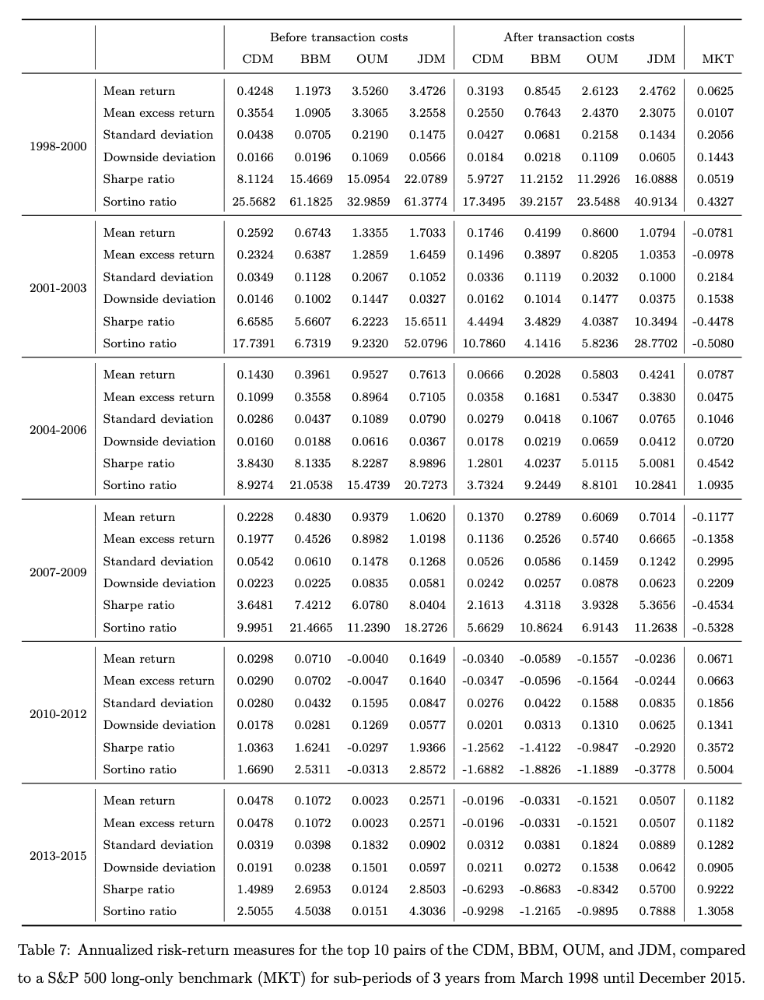

# pairs trading with jump model

本来这周的研究方向是lead-lag， 但是由于我太菜没有看懂，所以先做一些其他的工作铺垫一下。这篇文章发表于2018年，发在了QF上，作者自称在减掉了交易成本之后策略能有5.3的夏普，同时该文章附带有大量的实证结果。

## Introduction
配对交易发展至今主要分化成了几个流派：
1. time-series approach which focuses on mean-reverting spreads
2. describing the spread with a mean- reverting Gaussian Markov chain model, observed in Gaussian noise. The optimal entry and exit signals are derived by maximizing the probability of successful termination of the pairs trading strategy.

作者认为自己主要的contribution如下：
1. 介绍了一个pairs选择方法，基于jump diffusion model
2. 建立了一个策略
3. 在历史上进行回测，分别分析原因
4. spreads确实继承了很强的均值回归属性并且产生稳健的收益。

## Data Selection
1998.01-2015.12, top 500 in US

## Methodology
对于 mean-reverting spread 来说（作者这里以及之后把 mean-reverting spread 称为 spread），spread为：
$$
X_t = ln(\frac{S_A(t)}{S_A(0)}) - ln(\frac{S_B(t)}{S_B(0)}), \  \ t \geq 0
$$
所以对于 spred $X_t$ 来说，它服从：
$$
dX_t = \theta (\mu -X_t)dt + \sigma dW_t, \ \ X_0=x
$$

但是这样的建模或许是不正确的。因为开盘停盘机制，一些非连续的gap被捕捉到，而上面的公式不可能具备解释该种改变的能力。这些不连续的jump发生频率取决于停盘以及下一次的开盘时间。在这篇论文中，假设盘中发生跳跃的概率为零。一夜之间，跳跃以概率 λdt 随机发生。因此，等式中的最后一个组成部分仅在一夜之间影响利差。 我们定义 λ(t) 使得：
$$
\lambda(t) = 0. \ if \ the \ observation \ is \ intraday
$$
$$
\lambda(t) = \lambda. \ otherwise
$$
公式变为：
$$
dX_t = \theta (\mu -X_t)dt + \sigma dW_t + lnJ_tdN_t, \ \ X_0=x
$$

细节懒得从paper抄了。总之就是在模型中单独加入了一个 jump part。在模型拟合的过程中，如果数据为隔夜并且突然出现非常大的差值（统计上显著），那我们就把这个差值理解为jump，不参与到模型的拟合回归。

## study design & trading design
作者之后根据模型设计了策略，类似于传统pairs-trading策略，所以这里暂时忽略。

## Backtest
作者将自己的策略拿出来与其它的进行对比，作者的策略名称指代为JDM，其它经典的策略分别为CDM、BBM、OUM（几乎囊括了主流配对交易策略），对比结果如下

### strategy performance
总体上作者的JDM策略在，减掉了交易成本（作者没说剪了多少）之后，产生了大概60%的收益，以及5.3的夏普。

### Analyze year by year
作者控制 CDM、BBM、OUM、JDM 只交易每年的前10pairs情况下，对策略进行了对比。

作者认为：
1. 1998-2000 年正值互联网泡沫的增长时期。收益主要跟 bid-ask spread有关。
2. 2001-2003 战争打响，策略收益主要跟 low div deviation 有关
3. 2004-2006 温和时期，JDM并没有亮眼的表现
4. 2007-2009 金融危机，策略尤其在这个时间产生了极强的out-performance

综上， JDM在熊市这种剧烈动荡中的市场表现优异，主要得益于其 jump模块 过滤掉了不必要的信息，符合主管预期。